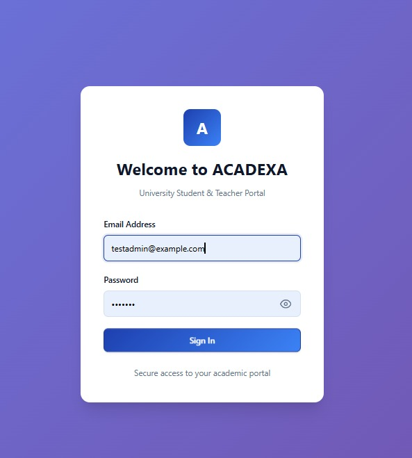
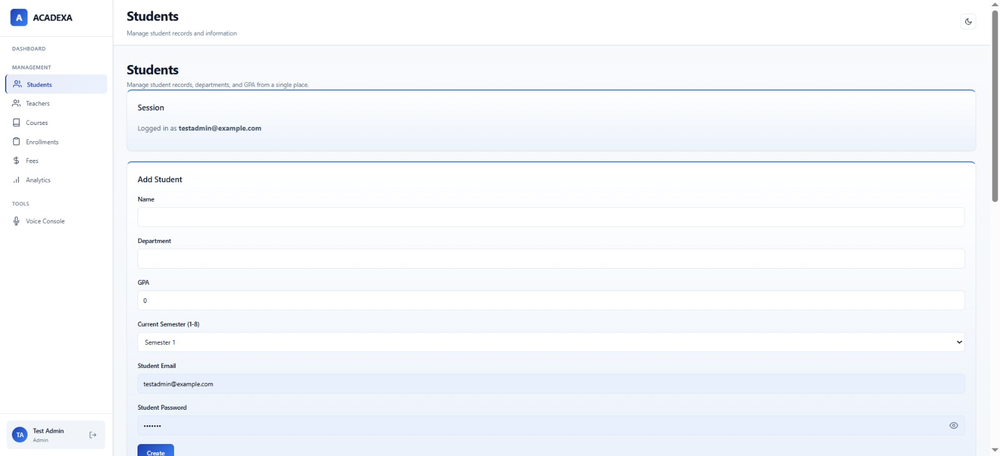
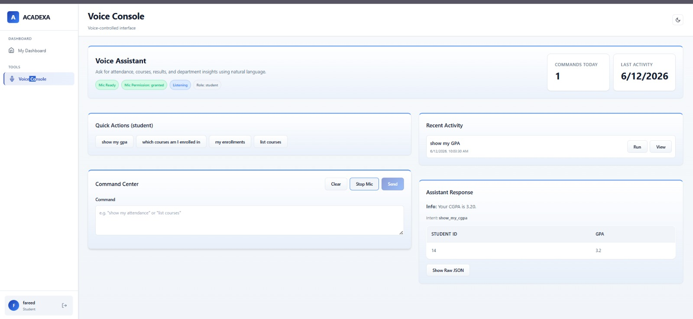
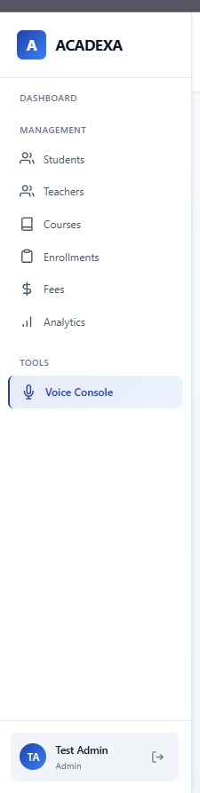
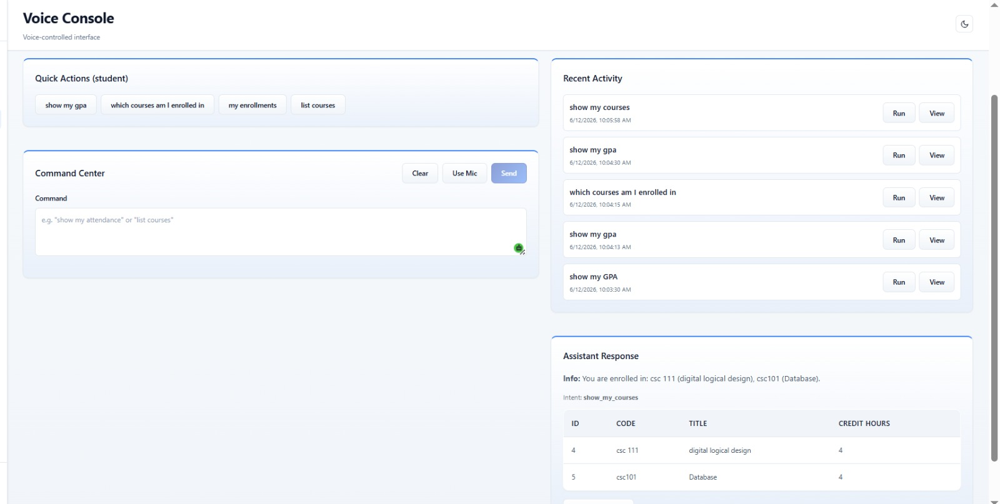

# Acadexa –Voice-Enabled Learning Management System

> An AI-powered, voice-enabled Learning Management System (LMS) that enables users to interact with academic services using natural voice commands. Acadexa combines NLP, FastAPI, PostgreSQL, and an LLM-powered fallback mechanism to deliver an intelligent learning experience.


---

## Project Overview

Acadexa is Voice-Enabled Learning Management System (LMS) developed as a Final Year Project (FYP). It allows students to interact with the LMS using voice commands instead of traditional navigation.

The system uses **Natural Language Processing (NLP)** to identify user intents and automatically invokes a **Large Language Model (LLM)** whenever a query cannot be answered through predefined intents. The backend is built with **FastAPI**, while **PostgreSQL** is used for persistent data storage.

---

##  Key Features

-  Voice-enabled interaction
-  NLP-based intent recognition
-  LLM fallback for complex queries
-  FastAPI REST APIs
-  Student Dashboard
-  Admin Panel
-  Course Management
-  Authentication
-  PostgreSQL integration
-  RESTful architecture

---

## Application Screenshots

###  Login Screen



---

### Dashboard



---

###  Voice Input



---

### Voice Console



---

###  NLP Intent Recognition – Show Courses



---

### Admin Panel


## Technology Stack

### Backend

- Python
- FastAPI
- SQLAlchemy

### Database

- PostgreSQL

### AI & NLP

- Natural Language Processing (NLP)
- Large Language Model (LLM)

### Frontend

- HTML
- CSS
- JavaScript

### Development Tools

- Git
- GitHub
- Visual Studio Code


## Project Structure

```text
acadexa/
│
├── backend/
├── frontend/
├── db/
├── docs/
│   └── images/
├── nlp/
├── scripts/
├── tests/
├── voice/
├── .env.example
├── .gitignore
└── README.md